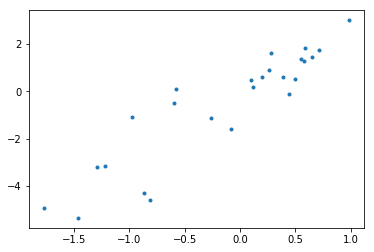

Lorem ipsum dolor sit amet, consectetur adipiscing elit. Aenean ac eros a nunc hendrerit tristique. Curabitur id gravida nisi, in commodo risus. Integer nec massa dolor. Lorem ipsum dolor sit amet, consectetur adipiscing elit. Vivamus augue erat, mattis ut turpis nec, dictum interdum enim. Donec venenatis convallis velit. Ut magna sapien, finibus a vulputate non, congue eu turpis. Sed eleifend accumsan mauris, nec tempor turpis dignissim sed. Duis hendrerit, tellus euismod maximus scelerisque, mauris risus laoreet nisi, quis molestie metus eros at erat. Aliquam non tincidunt est. Morbi dictum tempor augue, fringilla malesuada dui feugiat ut. Etiam et tempor urna. Aenean at lectus viverra, consequat turpis sed, scelerisque arcu.

Suspendisse eget eros ut ex feugiat egestas at ut urna. Morbi ut vulputate nisi, in mattis metus. Nullam consequat felis libero, sed posuere est auctor vitae. Fusce ullamcorper, enim quis malesuada facilisis, mauris diam tincidunt risus, in faucibus sem quam eu purus. Cras interdum at nunc at vehicula. Ut quis feugiat ante, quis tempus urna. Aenean mollis lacus et aliquam porta. Nullam nibh quam, commodo sed nibh et, interdum molestie metus. Aenean in leo ac ante dignissim hendrerit. Pellentesque quis ante nec ex iaculis scelerisque. \[ \log x \]


$$x^2 - 1 = 0$$

Nulla feugiat erat et elit convallis iaculis. Nunc lectus sapien, maximus sed malesuada sit amet, accumsan quis diam. Aliquam erat volutpat. Mauris ultrices, nunc et tempor porttitor, magna nulla elementum nisl, non egestas leo justo at quam. Aliquam laoreet malesuada mattis. Sed quis consequat tellus. Pellentesque habitant morbi tristique senectus et netus et malesuada fames ac turpis egestas. Vivamus lacinia cursus lectus non pulvinar. Proin vitae quam lacinia, imperdiet nibh eget, ornare lacus. Phasellus non orci sit amet eros suscipit malesuada. Proin vel ultrices est. Duis et viverra felis. Praesent convallis velit non rutrum pretium. Curabitur a augue eleifend, imperdiet nisi id, imperdiet ligula. Maecenas tellus nunc, vehicula ut velit et, facilisis finibus lorem.

Praesent quis ipsum nec orci ultricies eleifend volutpat sed velit. Sed sit amet fringilla augue. Nunc eu tincidunt dolor, non scelerisque velit. Aenean non purus id elit vulputate ornare. Aenean venenatis vehicula nisi, ut dapibus leo tempor id. Etiam nec diam ut sapien pharetra pretium quis a ante. Aenean hendrerit a velit nec euismod. Ut laoreet, odio ut semper condimentum, tellus erat tempus est, sit amet volutpat nibh mi luctus est. Class aptent taciti sociosqu ad litora torquent per conubia nostra, per inceptos himenaeos. Nunc in nisl vitae dui maximus euismod vel et odio. In at tellus commodo magna venenatis placerat. Donec vitae sagittis ex, eu posuere urna. Maecenas a interdum nisi. Etiam feugiat ultrices mi, nec egestas enim. Phasellus in accumsan risus, quis commodo massa. Nunc a est quis magna pharetra pretium.

Phasellus posuere vitae lacus ac gravida. Duis nisi turpis, lobortis et enim ac, laoreet iaculis elit. Mauris aliquam mollis ornare. Integer ante sem, pellentesque aliquam elit sed, bibendum eleifend ipsum. Vestibulum pharetra sapien auctor nisl iaculis condimentum. Sed egestas finibus sodales. Cras rutrum purus id porta pulvinar. Sed feugiat, neque ac tristique condimentum, lectus odio egestas libero, luctus faucibus turpis sem id tellus. Fusce facilisis sapien a ornare condimentum. Cras sodales tristique est, non dapibus justo. Fusce fermentum, tellus vel convallis suscipit, ex tellus ornare felis, eget faucibus tortor erat sed tellus. Ut dui lacus, mollis in erat molestie, posuere tempor est. Donec a venenatis mauris. Duis semper, sem eget dapibus scelerisque, nulla augue commodo ex, at blandit nisi ante a lectus.

```python
def fib(n):
  return(2)
```


def fib(n):
  return(2)


```python
def fib(n):
  return(2)
```


